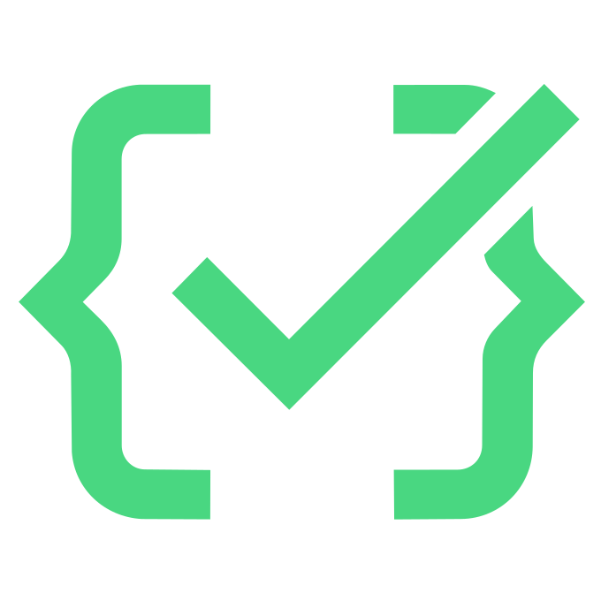

<p align="center"></p>

# factible

**Infraestructura open source para integrarte con el Estado uruguayo.** MIT.

Un conector por organismo, misma experiencia: TypeScript tipado, simuladores incluidos para desarrollar sin trámites, y output validado contra las especificaciones oficiales.

```bash
npm install @factible/validar     # estable
npm install @factible/bcu         # verificado contra el WS real del BCU
npm install @factible/montevideo  # verificado contra las APIs reales de la IM
npm install @factible/cfe         # beta — no usar en producción aún
```

| Paquete | Qué resuelve | Estado |
|---|---|---|
| [`@factible/cfe`](packages/cfe) | Facturación electrónica DGI: e-Ticket, e-Factura, sobres, acuses, reporte diario, representación impresa | 🟡 Beta offline (pendiente homologación DGI) |
| [`@factible/validar`](packages/validar) | Dígito verificador y validación de CI y RUT uruguayos. Cero dependencias | 🟢 Estable — también en [Python, PHP, Go y Java](ports) |
| [`@factible/bcu`](packages/bcu) | Cotizaciones oficiales del Banco Central | 🟢 Estable — verificado contra el servicio real |
| [`@factible/montevideo`](packages/montevideo) | Intendencia de Montevideo: buses del STM en tiempo real, arribos a paradas (TEA) y banderas de playas | 🟢 Validado contra las APIs reales |
| [`@factible/id-uruguay`](packages/id-uruguay) | Login con cédula (OpenID Connect / AGESIC), con mock del OP incluido | 🟡 Beta (esperando credenciales de testing de AGESIC) |
| `@factible/bps` | Generación tipada de archivos de nómina | 🔍 Explorando |

## Filosofía

- **DX primero:** integrar con el Estado no debería requerir semanas leyendo PDFs.
- **Desarrollá sin trámites:** cada conector trae un mock del organismo para testear tu integración completa.
- **Fiel a la spec:** los esquemas y formatos oficiales viven en el repo y los tests validan contra ellos.
- **Sin cajas negras:** todo MIT, todo autohosteable.

## Documentación

- [Plan de conectores](docs/plan-conectores.md) — triaje de organismos y roadmap.
- Cada paquete tiene su README y guía propia.

## Desarrollo

```bash
npm install
npm test     # todos los workspaces
```
